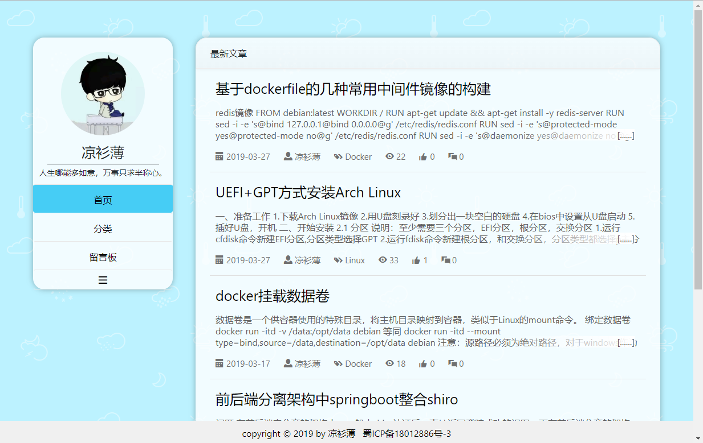

# 虫洞博客
[](https://github.com/stdutil/blog-springboot/releases)
[](https://github.com/stdutil/blog-springboot/network/members)
[](https://github.com/stdutil/blog-springboot/stargazers) 
[](https://github.com/stdutil/blog-springboot/archive/master.zip)
[](https://github.com/stdutil/blog-springboot/releases)
[](https://github.com/stdutil/blog-springboot/blob/dev/LICENSE)

## 响应式布局
|pc布局|mobile布局|
|:---:|:---:|
|||

## 项目介绍
本博客系统是在原来的[SSM架构的博客系统项目](https://github.com/stdutil/blog-ssm)基础上，用`springboot`重写的，简化了很多繁琐的xml配置。项目同样
整合了许多常用的框架和中间件，例如Redis,Druid,Redis,Freemarker,Shiro等配置，此项目不管是作为当下互联网架构项目的脚手架，还是学习为目的，都是一个不错的选择。

## 功能
* 文章发表
* 文章导出
* 用户管理
* 分类
* 评论
* 点赞
* 访客记录
* 图片管理
* 菜单管理
* 数据库备份

## 技术架构
* SpringBoot - [SpringBoot](https://spring.io/projects/spring-boot/)
* 数据源 - [Druid](http://druid.io/)
* 持久化框架 - [Mybatis](http://www.mybatis.org/mybatis-3/)
* 缓存 - [Redis](https://redis.io/)
* 认证授权安全框架 - [Shiro](http://shiro.apache.org/)
* 模板渲染引擎 - [Freemarker](https://freemarker.apache.org/)
* 模块化前端框架 - [Layui](https://www.layui.com/)
* markdown编辑器 - [editor.md](http://pandao.github.io/editor.md/examples/)
* 日志系统 - [slf4j](https://www.slf4j.org/) + [logback](https://logback.qos.ch/)

## 如何使用
1. git clone项目
2. 将`application.properties`中的`spring.datasource.username`和`spring.datasource.password`改为你的数据库账户和密码,`mysql`
和`redis`都是按照默认的端口配置，如有需要也可更改配置文件，指定`ip`和`port`。
3. 运行`mvn package`，将项目打包成`war`包，然后将打包后`war`包放到`tomcat`的`webapps`目录即可，无需手动建表，容器初始化时会自动建表。
4. 注意用外置的`servlet`容器部署时，需要配置去除项目名访问，不然会报`404`错误。
5. 运行`startup.sh`启动`tomcat`(如果是用内嵌`servlet`容器，直接运行`java -jar blog.war`即可)。
6. 后台管理系统地址为`http://domain:port/admin`，初始用户名为`363408268@qq.com`,初始密码为`19960821`。

## 环境搭建
### Linux 环境部署
1. 下载并解压 [JDK 1.8](https://www.oracle.com/technetwork/java/javase/downloads/jdk8-downloads-2133151.html)
```
tar zxvf jdk-8u172-linux-x64.tar.gz
mv jdk1.8.0_172 /usr/local/jdk
```

2. 下载并解压 [Redis 4.0.9](http://www.redis.cn/download.html)(或者直接通过软件源安装)
```
tar zxvf redis-4.0.9.tar.gz
mv redis-4.0.9 /usr/local/redis
```

3. 下载并解压 [Tomcat 9.0.8](https://tomcat.apache.org/download-90.cgi)
```
tar zxvf apache-tomcat-9.0.8.tar.gz
mv apache-tomcat-9.0.8 /usr/local/tomcat
```

4. 安装`MySQL`或`MariaDB`
>如果是`mariadb`需要将`user`表中的`plugin`字段值'unix_socket'改为'mysql_native_password',否则`jdbc`连接会出错
* `Debian`系列`Linux`参考以下过程
```
#apt-get update //获取最新软件包
#apt-get install mariadb mariadb-server //安装mariadb客户端和服务器
#service mysql start //启动服务
#mysql_security_installation //执行安全安装脚本
```
* `Redhat`系列`Linux`参考以下过程
```
#yum update
#yum install mariadb mariadb-server
#systemctl start mariadb
#mysql_security_installation
```

5. 设置环境变量(用vim打开/etc/profile这个文件,在后面添加以下内容)
```
export JAVA_HOME=/usr/local/jdk
export JRE_HOME=$JAVA_HOME/jre
export CLASSPATH=.:$JAVA_HOME/lib/dt.jar:$JAVA_HOME/lib/tools.jar:$JAVA_HOME/lib:$JRE_HOME/lib:$CLASSPATH
export PATH=$JAVA_HOME/bin:$JRE_HOME/bin:$PATH

export CATALINA_HOME=/usr/local/tomcat
export CATALINA_BASE=/usr/local/tomcat
export PATH=$CATALINA_HOME/bin:$PATH

export PATH=/usr/local/redis/bin:$PATH
```

6. 启动`redis`和`mysql`
```
redis-server &
systemctl start mysql
```

7. 将打包好的`war`包放入`tomcat`的`webapps`目录

8. 启动`tomcat`
```
startup.sh
```

### Docker部署(推荐)
1. 下载源码后在根目录下运行以下命令
```
mvn package
mvn dockerfile:build
```

2. 不出意外本地已经成功生成docker镜像了，你可以push到你的docker仓库中，随时pull到任何一台docker容器中部署了

3. 运行容器
>`tag`是当前版本号
```
docker run -d -p 80:80 stdutil/blog-springboot:tag
```

## 项目结构
java (源码根目录)  
&emsp;&emsp;|----net.stackoverflow.blog  
&emsp;&emsp;&emsp;&emsp;|----common/ (公共类)  
&emsp;&emsp;&emsp;&emsp;|----config/ (项目配置目录，基于Java代码的配置)  
&emsp;&emsp;&emsp;&emsp;|----dao/ (数据访问对象，一般存放mybatis的mapper接口或jpa的repository接口)  
&emsp;&emsp;&emsp;&emsp;|----exception/ (异常类定义)  
&emsp;&emsp;&emsp;&emsp;|----pojo/ (存放po，vo，dto等类，可进一步划分子包)  
&emsp;&emsp;&emsp;&emsp;|----service/ (服务接口以及实现类)  
&emsp;&emsp;&emsp;&emsp;|----shiro/ (shiro相关代码)  
&emsp;&emsp;&emsp;&emsp;&emsp;&emsp;|----cache/ (shiro整合redis缓存相关代码)  
&emsp;&emsp;&emsp;&emsp;&emsp;&emsp;|----filter/ (shiro自定义过滤器)  
&emsp;&emsp;&emsp;&emsp;&emsp;&emsp;|----realm/ (shiro自定义realm)  
&emsp;&emsp;&emsp;&emsp;|----task/ (后台任务)  
&emsp;&emsp;&emsp;&emsp;|----util/ (工具类)  
&emsp;&emsp;&emsp;&emsp;|----validator/ (校验工具)  
&emsp;&emsp;&emsp;&emsp;|----web/ (web相关代码)  
&emsp;&emsp;&emsp;&emsp;&emsp;&emsp;|----controller/ (业务层，提供restful接口)  
&emsp;&emsp;&emsp;&emsp;&emsp;&emsp;|----interceptor/ (拦截器)  
&emsp;&emsp;&emsp;&emsp;&emsp;&emsp;|----listener/ (监听器)  

resources (资源文件夹)  
&emsp;&emsp;|----mapper/ (存放mybatis的mapper.xml)  
&emsp;&emsp;|----sql/ (存放sql脚本)  
&emsp;&emsp;|----static/ (存放静态资源，css、js等)  
&emsp;&emsp;|----templates/ (存放freemarker或thymeleaf模板)  
&emsp;&emsp;|----application.properties (项目配置文件)  
&emsp;&emsp;|----logback.xml (logback日志配置)